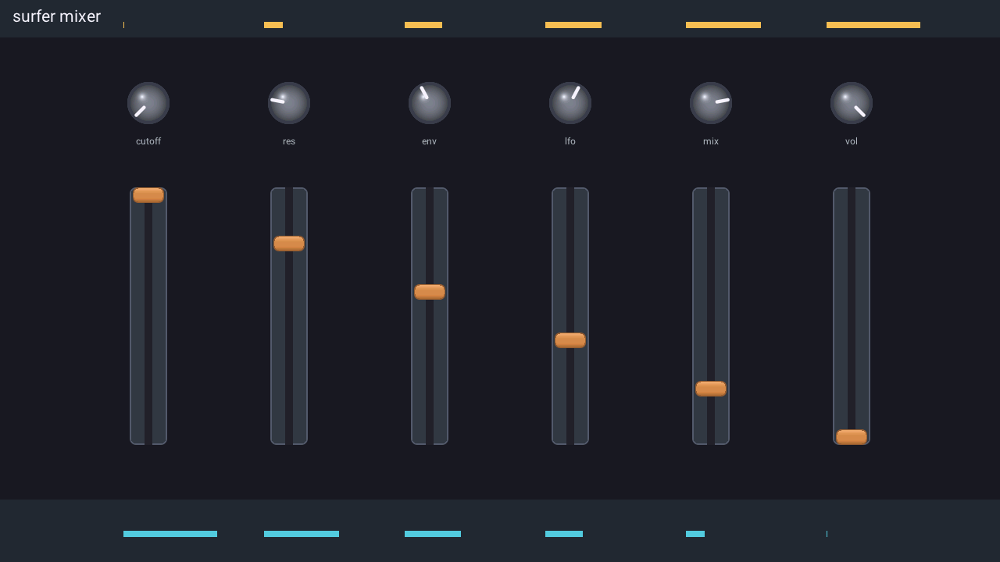
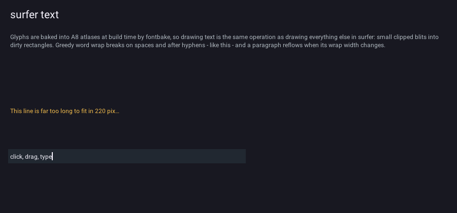
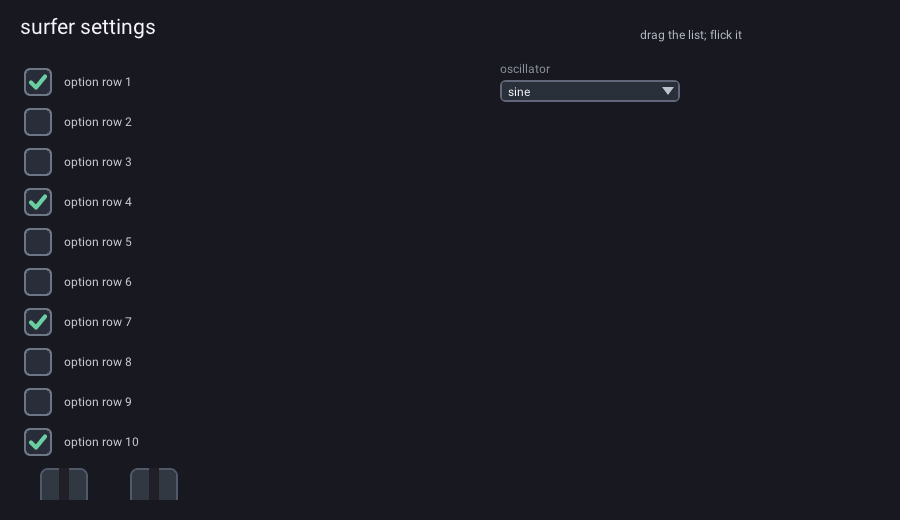
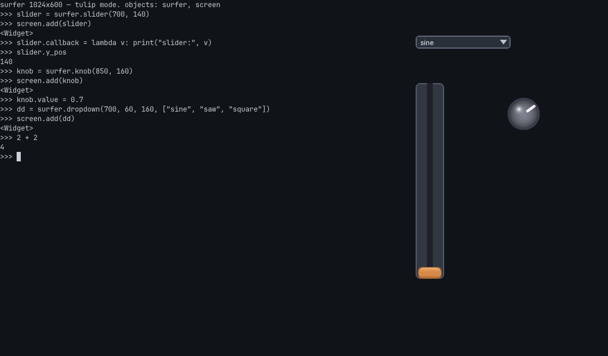
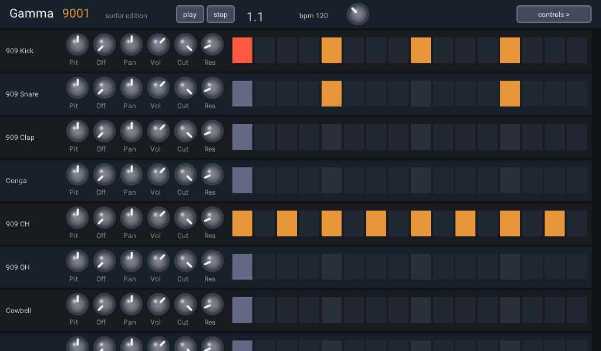
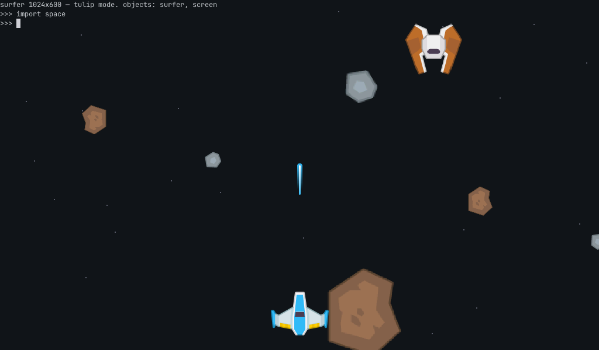
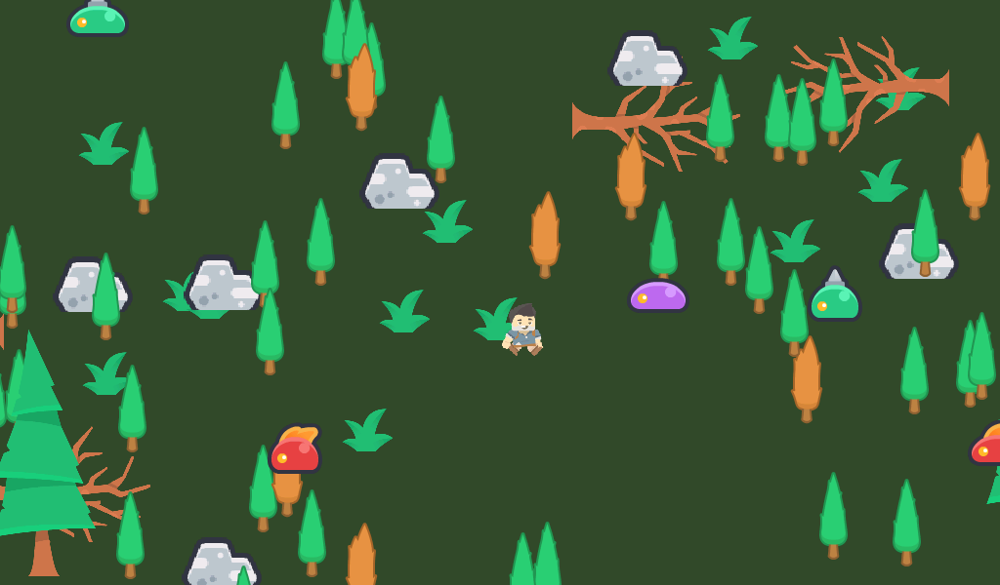

# surfer

**High-performance UI library for the ESP32-P4 and framebuffers.**

surfer is a small retained-mode UI compositor: C11 core, backends for the
ESP32-P4 (MIPI DSI + PPA), desktop (SDL2), and web (emscripten).
It is meant to be set up at runtime in Python or Micropython on MCUs, the web or desktop.

Our goal is to get 60FPS iOS-style low latency widget control at large resolutions on an MCU.

> ⚠️ **Early days.** This is an architecture experiment with working code and
> real measurements, not a finished library. The API will change. We're
> through M7 of the milestone plan in [DESIGN.md](DESIGN.md) — which is
> the source of truth for how everything works and why. All three
> backends run the same MicroPython "repl mode": on the P4's panel, in
> an SDL window, and in a browser canvas.



*The mixer demo — 6 filmstrip knobs + 6 sliders, draggable by mouse or
finger, with baked-atlas labels. This exact scene runs at 63–66 fps under
finger on an ESP32-P4, every pixel composited by the PPA. (Screenshots are
straight framebuffer dumps, `SURF_SHOT=x.ppm`.)*



*M3 text: greedy word wrap, ellipsize, and an editable textinput with
caret, selection, and scroll-into-view. Glyphs are stb_truetype-baked A8
atlases; drawing text is the same clipped-blit path as everything else.*



*M4: a scrollable settings panel (flick momentum + edge spring-back run
in core ticks) with checkboxes, sliders, and a dropdown whose popup
overlays via detach/reattach. Scrolling steals taps after an 8px
threshold; slider and knob drags are never stolen.*



*M5, "repl mode": a MicroPython REPL rendered into a surfer textgrid,
with widgets created live from typed Python — `s = surfer.slider(x, y)`,
`screen.add(s)`, `s.callback = fn`. Hand-written binding, unix port.
The Python API is documented in [docs/python-api.md](docs/python-api.md).*



*The real-world test: the [Gamma 9001](https://shorepine.github.io/amy/gamma9001/)
drum machine's UI rebuilt as a ~350-line MicroPython program
([examples/gamma9001.py](bindings/surfer/examples/gamma9001.py)) — 8
scrollable channel rows, 96 small knobs, step pads as custom Python
widgets on `node.on_touch`, a running playhead, and a second page of
control panels behind a button (detach/reattach). No audio yet.*



*M7 sprites: PNGs loaded at runtime from MicroPython
(`surfer.image(bytes)` → `surfer.sprite(img, x, y)`), any size, alpha
channel, `.scale` (1/16–16×) and `.rot` (quarter turns — the P4 PPA's
SRM limit). Moving one repaints only what it uncovers, like any node.
[examples/space.py](bindings/surfer/examples/space.py), Kenney CC0 art;
`import space` from repl mode on any backend. On the P4 a transformed
sprite is two PPA ops (SRM + blend); desktop and web use a software
inverse-map in the hal.*



*And a game: [examples/forest.py](bindings/surfer/examples/forest.py) —
an elf (arrow keys, `mirror_x` to face the way it walks) in a dense
2048×1200 scrolling forest, fenced by a ring of boulders, with slime
critters wandering on their own and logs (dead trees at `rot=90`),
rocks and tree trunks blocking everyone. Every sprite was found by
grepping [assets/kenney/lib/index.tsv](assets/kenney/lib/) descriptions
— 39k CC0 Kenney sprites indexed as `path → description → size` so a
program (or an LLM) can pick art without looking at pixels. `import
forest` from repl mode.*

## The idea

At 1080p RGB565, one frame is ~4 MB. On an ESP32-P4 the framebuffer lives in
PSRAM behind a few hundred MB/s of shared bandwidth — we measured CPU writes
at ~87 MB/s and the PPA's fastest engines at ~360 MB/s. Full-frame redraw at
60 fps is arithmetic you cannot win. So surfer never tries:

- **Never redraw the full frame.** Dirty-rect composition only. Moving a
  knob damages one small rect; that's the whole frame's work.
- **Never rasterize at frame time.** Widget visuals are pre-rendered assets:
  filmstrips (a knob is 64 baked frames), 9-slice patches, baked font
  atlases. A runtime-loaded sprite PNG is still a pre-rendered asset —
  decode happens at load, never per frame. If a widget "needs" runtime
  drawing, the answer is a better asset.
- **The frame path is blits.** Fill / blit / alpha-blend, executed by the
  P4's PPA + 2D-DMA on device, by a small software loop on desktop. The hal
  is a ~10-function vtable; everything above it is platform-free C11.

## vs. LVGL

LVGL is a great, mature, general-purpose library — surfer is deliberately
not that. The trade-offs we're betting on:

| | LVGL | surfer |
|---|---|---|
| Frame path | software rasterizer, PPA accelerates ~30% of it (experimental) | 100% hal blits — the PPA executes the entire frame path |
| Widget visuals | drawn at runtime (vector-ish styles) | pre-rendered assets, composited |
| Text | runtime FreeType/tiny_ttf or pre-baked | atlases baked at build time, drawing is blits (M3) |
| Cache coherency on P4 | scattered, a known source of bugs | owned in one place in the hal (`surf_hal_p4_sync`) |
| API surface | thousands of symbols, generated bindings | ~8 node types, ~60 functions, hand-written bindings |
| Multitasking UIs | manual | subtrees detach/reattach losslessly — an app's UI is one group |
| Maturity | production, huge ecosystem | **experiment in progress** |

## Measured (ESP32-P4-Function-EV-Board, 1024×600 DSI, IDF 5.4)

The M2 milestone was "prove the whole bet on hardware, or stop." Numbers
from the built-in benchmark and the 6-knobs + 6-sliders demo:

- Finger drag on the mixer demo: **63–66 fps sustained, ~2 ms/tick** (~7×
  headroom against the frame budget)
- Pathological worst case (every widget + full-screen repaint every frame):
  ~18 ms/tick, ~55 fps
- Presentation: triple-buffer-with-damage — zero-copy DSI flips + DMA2D
  damage-forward. Flicker- and tear-free. The measurements that picked it
  over single- and double-buffering are in DESIGN.md §5.2.
- PPA per-op overhead is ~70–200 µs regardless of size, which reshaped the
  asset rules: bake art at final size when you can (one blit beats 110
  tiled ones by ~12 ms).

## Supported platforms

| platform | status | notes |
|---|---|---|
| **ESP32-P4** (MIPI DSI + PPA) | working | the primary target — 60 fps widgets under finger, 91 fps text scroll; MicroPython "repl mode" verified on hardware (on-screen REPL + USB keyboard) |
| **Desktop** (SDL2, macOS/Linux) | working | the iteration loop; also hosts the MicroPython unix build |
| **Web** (emscripten canvas) | working | the SDL hal compiled with emscripten. C demos via ASYNCIFY; repl mode runs MicroPython's webassembly port with **no** ASYNCIFY — the browser drives frames (`repl.frame()` per rAF) and the VM never suspends |
| **RP2350** (HSTX DVI, e.g. Fruit Jam) | researched | no blitter but a good CPU-compositing fit at 320×240/400×240 RGB565 — [notes here](docs/rp2350-notes.md) |
| **ESP32-S3** (parallel RGB, tulipcc today) | researched | standalone port not worth it at 1024×600; the good path is surfer-as-widget-layer inside tulipcc's engine — [notes here](docs/esp32s3-notes.md) |

## Layout & building

```
include/surfer.h        public API (the binding surface)
src/core/               scene graph, dirty rects, hit test, input, runtime images
src/text/               baked-atlas text: label, textinput, textgrid
src/widgets/            knob, slider, button, checkbox, dropdown
src/hal/sdl/            desktop + web backend (per-pixel code lives only here)
src/hal/p4/             ESP32-P4 backend: PPA, DSI flips, DMA2D, GT911 touch
bindings/surfer/        MicroPython binding, repl.py, examples/, web variant
ports/esp32p4/          native ESP-IDF project (benchmark + C demo)
tools/                  asset bakers (fontbake, pngwrap), vendored stb
assets/                 fonts + demo art (Kenney CC0 under assets/kenney/)
demos/                  C demos: mixer, settings, type, editor, bounce
```

Desktop (needs SDL2 + python3):

```
make sdl && ./build/surfer_demo    # 6 knobs + 6 sliders, drag with mouse
make test                          # unit tests, no SDL needed
make test-sdl                      # present-coherence regression (opens a window)
make mpy MPY_DIR=~/micropython     # MicroPython unix port with the surfer module
```

Web (needs emscripten):

```
make web                           # C demos → build/web/{mixer,settings}.html
make mpy-web MPY_DIR=...           # repl mode → build/web/index.html
```

Device (MicroPython, micropython ≥ 1.28 + IDF 5.5.1): surfer builds as a
MicroPython user C module for the esp32 port — a consuming project's board
build includes it (see `bindings/surfer/micropython.cmake`) and boots
`repl.py` or its own app on the panel, with `import space` / `import
gamma9001` live on the glass.

Native device firmware (benchmark + mixer demo, IDF ≥ 5.4):

```
cd ports/esp32p4
idf.py -p <port> flash monitor
```

## Status

- [x] M0 — hal vtable, SDL backend, dirty-rect compositor
- [x] M1 — filmstrip/9-patch nodes, knob + slider, touch capture
- [x] M2 — P4 backend: PPA, DSI, buffering benchmark, 60 fps under finger
- [x] M3 — text: baked font atlases, label, wrap, textinput + caret
- [x] M4 — scrollview + momentum, checkbox, dropdown
- [x] M5 — MicroPython bindings; repl mode on unix and on P4 hardware
      (on-glass REPL, USB keyboard, gamma9001)
- [x] M6 — web build: C demos (emscripten+SDL2) and repl mode in a
      canvas (MP webassembly port, browser-driven frames, no ASYNCIFY)
- [x] M7 — sprites: runtime PNG loading from Python, any size, alpha,
      scale + quarter-turn rotation (PPA SRM on device)
- [ ] M8 — real art pass, default theme
- [ ] later — sprite sub-rect animation, on-screen keyboard widget,
      audio hooks, app switcher (an OS layer above surfer)

## License

MIT
